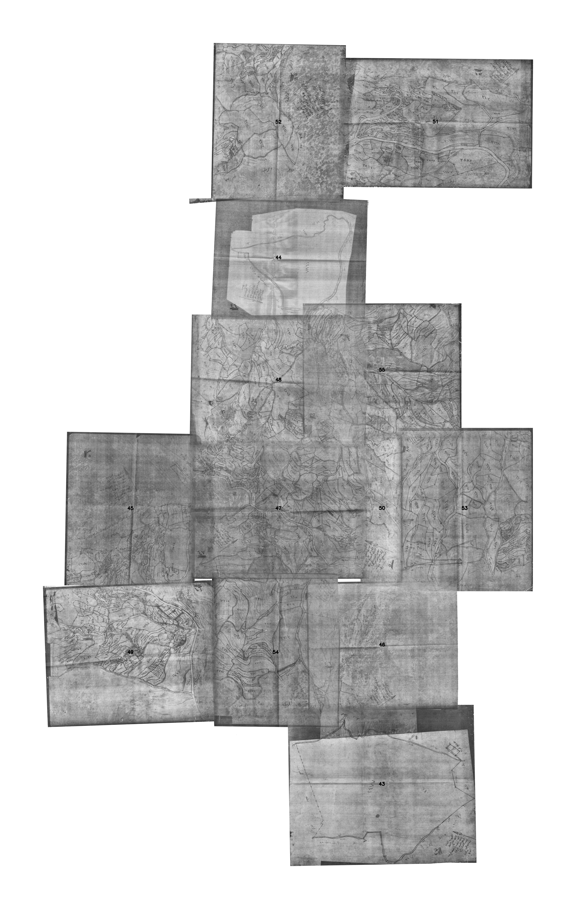
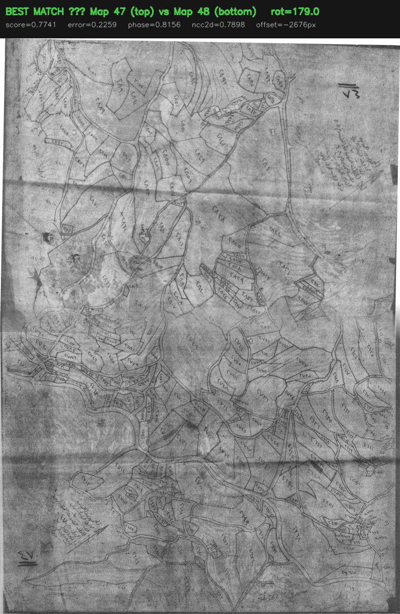
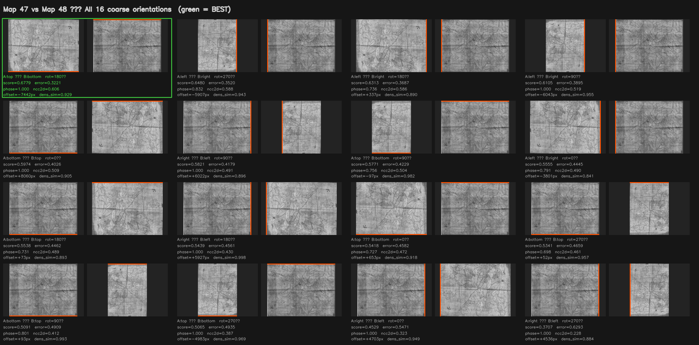
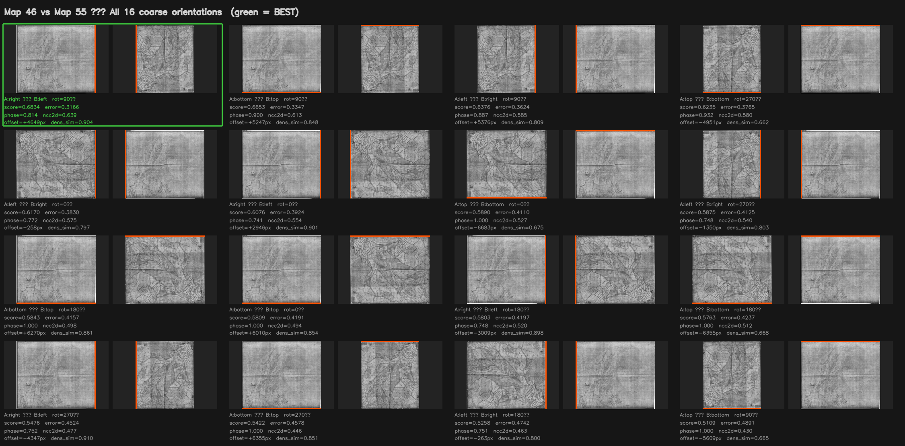
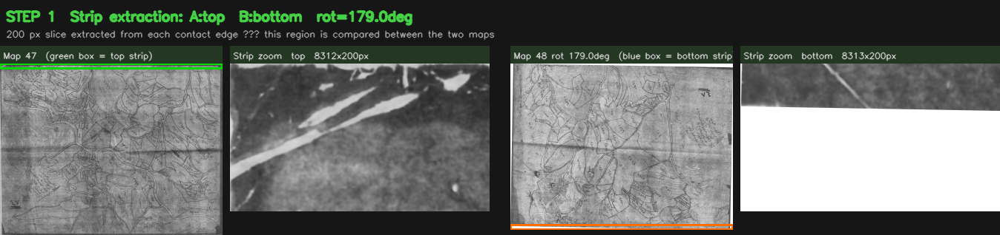
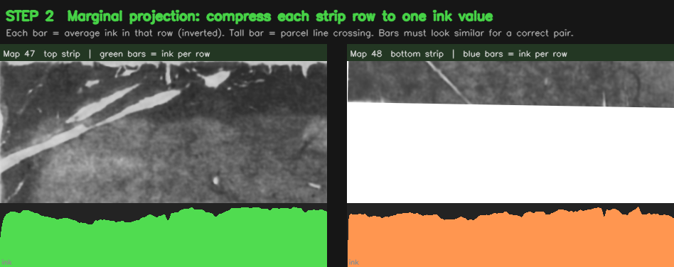
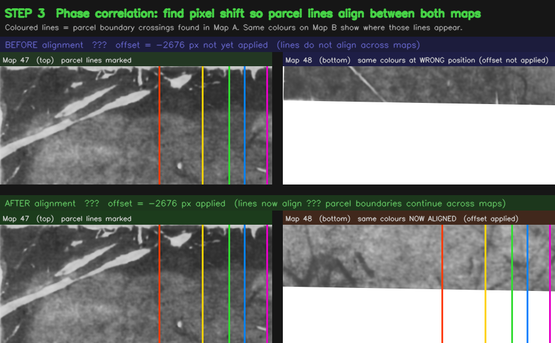
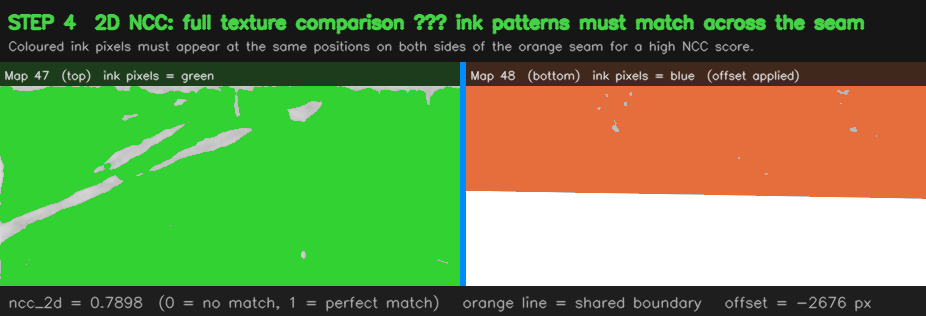
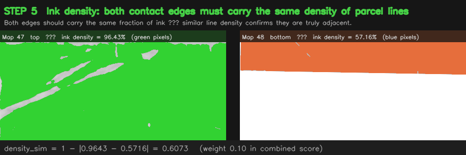
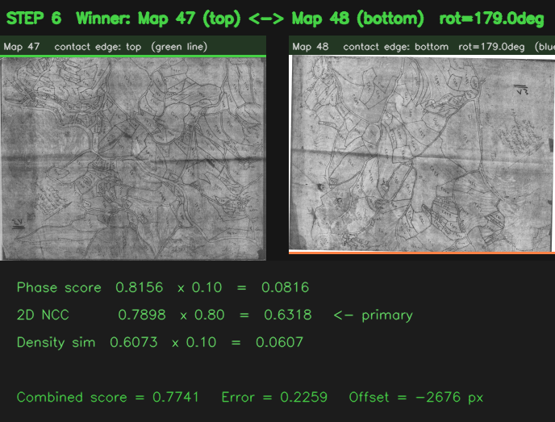

# AI-Based Panoramic Reconstruction of Cadastral Maps

Research code for a Master's thesis on reconstructing panoramic images from
historical Lebanese cadastral map sheets. The project combines document-image
processing, parcel instance segmentation, graph construction, and automatic
map-edge orientation estimation.

**Author:** Hussein Chalhoub  
**Degree:** Master in Artificial Intelligence  
**University:** Universite Saint-Joseph de Beyrouth  
**Supervisor:** Prof. Mohamad Khalil  
**Year:** 2026

## Research contribution

Adjacent cadastral sheets do not contain visual overlap and are not distributed
with reliable coordinate metadata. This makes standard feature matching,
including SIFT, unsuitable for the reconstruction task.

The main contribution is `new_pipeline/src/edge_orientation_finder.py`. For a
known adjacent pair, it evaluates all four possible shared-edge orientations
and four coarse rotations, then refines the best candidate with a fine rotation
search. Each candidate is scored from boundary evidence:

```text
combined = 0.50 * phase_ncc + 0.30 * ncc_2d + 0.20 * density_similarity
error = 1.0 - combined
```

The method uses only the scanned map images. It does not require parcel numbers,
training labels, or manual clicks for edge-orientation estimation.

## Pipeline

| Component                   | Entry point                                                        | Purpose                                                      |
| --------------------------- | ------------------------------------------------------------------ | ------------------------------------------------------------ |
| Classical preprocessing     | `output/code/step1_preprocessing.py`                               | Denoising, contrast enhancement, deskewing, and binarization |
| Classical matching baseline | `output/code/step2_edges.py`, `step3_sift.py`, `step4_matching.py` | Edge, feature, and homography experiments                    |
| Parcel segmentation         | `new_pipeline/src/step4_segmentation.py`                           | Mask R-CNN parcel instance segmentation                      |
| Parcel graphs               | `new_pipeline/src/step5_graph.py`                                  | Build adjacency graphs from detected parcels                 |
| Parcel matching             | `new_pipeline/src/step6_gnn_matching.py`                           | Experimental graph-neural-network matching                   |
| Edge orientation            | `new_pipeline/src/edge_orientation_finder.py`                      | Automatic shared-edge and rotation search                    |
| Panorama reconstruction     | `output/code/step6_panorama.py`                                    | Warp, blend, and export connected map components             |

The repository also contains experimental OCR, shape-matching, interactive
annotation, and panorama utilities under `new_pipeline/src/`.

## Reported results

On the thesis dataset:

- 11,414 parcels were detected across 13 map sheets.
- The edge-orientation method obtained scores of 0.8865 for pair 45-47 and
  0.7741 for pair 47-48.
- Two panorama components were produced at full original scan resolution.

These figures describe the current research experiments. They are not a claim
that every map pair can be reconstructed automatically: the GNN matching and
OCR experiments remain exploratory, and some panorama components still depend
on manually established homographies.

## Visual results

The following examples show the output of the automatic edge-orientation
pipeline and the resulting panorama. All images are generated from the
experiments in `new_pipeline/data/orientation_results/`.

### Panorama reconstruction

This panorama is the final reconstructed output produced after estimating the
relative placement of the map sheets and blending them into a single image.

<p align="center">
  
</p>

### Best edge alignment

This result shows the best alignment found for map pair 47-48. The candidate
combines phase correlation, two-dimensional normalized cross-correlation, and
ink-density similarity to estimate the shared edge, rotation, and offset.

<p align="center">
  
</p>

### Orientation score grids

For each tested pair, the method evaluates 16 configurations: four possible
shared-edge orientations and four rotations. Each cell in the grid reports the
score for one configuration; higher scores indicate stronger boundary
agreement.

<p align="center">
  
  <br>
  <em>All candidate orientations and rotations for map pair 47-48.</em>
</p>

<p align="center">
  
  <br>
  <em>Example score grid for another tested map pair.</em>
</p>

### Edge-orientation pipeline steps

The diagnostic images below make the decision process visible. They show the
edge strips extracted from each map, the one-dimensional boundary profiles,
alignment by phase correlation, the two-dimensional correlation response,
density similarity, and the final combined score.

| Step | Diagnostic output                                                                               | What it shows                                                 |
| ---- | ----------------------------------------------------------------------------------------------- | ------------------------------------------------------------- |
| 1    | [Extracted edge strips](new_pipeline/data/orientation_results/pair_47_48_step1_strips.png)      | The candidate strips taken from the map boundaries.           |
| 2    | [Boundary profiles](new_pipeline/data/orientation_results/pair_47_48_step2_profile.png)         | One-dimensional ink profiles used for phase correlation.      |
| 3    | [Phase-correlation alignment](new_pipeline/data/orientation_results/pair_47_48_step3_align.png) | The estimated offset between the two boundary signals.        |
| 4    | [2D NCC response](new_pipeline/data/orientation_results/pair_47_48_step4_ncc2d.png)             | The spatial correlation between aligned edge regions.         |
| 5    | [Ink-density similarity](new_pipeline/data/orientation_results/pair_47_48_step5_density.png)    | Comparison of the amount of ink near each candidate edge.     |
| 6    | [Final combined score](new_pipeline/data/orientation_results/pair_47_48_step6_score.png)        | The combined evidence used to rank the candidate orientation. |

<details>
<summary>View the diagnostic images inline</summary>

<p align="center">
  
  <br><em>Step 1: edge strips.</em>
</p>

<p align="center">
  
  <br><em>Step 2: boundary profiles.</em>
</p>

<p align="center">
  
  <br><em>Step 3: phase-correlation alignment.</em>
</p>

<p align="center">
  
  <br><em>Step 4: two-dimensional NCC.</em>
</p>

<p align="center">
  
  <br><em>Step 5: ink-density similarity.</em>
</p>

<p align="center">
  
  <br><em>Step 6: final combined score.</em>
</p>

</details>

## Reproducibility

The source dataset is not included. It was provided by the thesis supervisor
and contains legally sensitive land-ownership records. The trained weights and
derived outputs in this repository may also be subject to the same access
restrictions.

To run the image pipeline on an authorized dataset, place preprocessed images
in `output/preprocessed/` using the naming convention
`map_<number>_clean.png`, then run commands from the repository root.

### Installation

```powershell
python -m venv venv_thesis
.\venv_thesis\Scripts\Activate.ps1
python -m pip install --upgrade pip
pip install -r requirements.txt
```

The deep-learning stages require a compatible PyTorch, TorchVision, and
PyTorch Geometric installation. GPU acceleration is recommended for Mask R-CNN
training and inference. On Windows, the training scripts use
`num_workers=0` for compatibility.

### Example commands

```powershell
# Run preprocessing
python output/code/step1_preprocessing.py

# Train Mask R-CNN
python new_pipeline/src/step4_segmentation.py --train

# Run segmentation on all available maps
python new_pipeline/src/step4_segmentation.py --infer --all

# Build parcel graphs
python new_pipeline/src/step5_graph.py

# Estimate orientation for one adjacent pair
python new_pipeline/src/edge_orientation_finder.py --pair 47_48 --visualise

# Estimate orientation for all configured pairs
python new_pipeline/src/edge_orientation_finder.py --all --visualise

# Assemble panorama components from available homographies
python output/code/step6_panorama.py
```

The orientation finder writes ranked scores and visualisations to
`new_pipeline/data/orientation_results/`. Panorama outputs are written to
`output/panorama/`.

## Repository layout

```text
dataset/                  Research input data and references
new_pipeline/src/         Segmentation, graphs, matching, OCR, and orientation
new_pipeline/data/        Intermediate predictions, graphs, matches, and results
new_pipeline/models/      Trained model checkpoints
output/code/              Classical preprocessing and panorama scripts
output/preprocessed/      Prepared map images (not redistributed)
output/panorama/          Generated panorama components
```

## Limitations and responsible use

This is research software, not a cadastral production system. Results must be
reviewed by a qualified human before being used for surveying, legal, or land
ownership decisions. Performance depends on scan quality, map adjacency, and
the availability of valid homographies or parcel correspondences.
